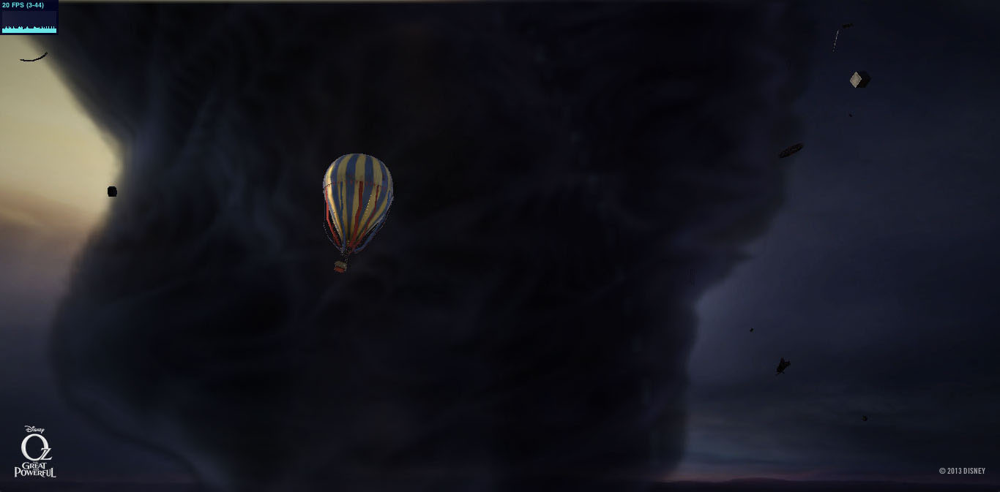
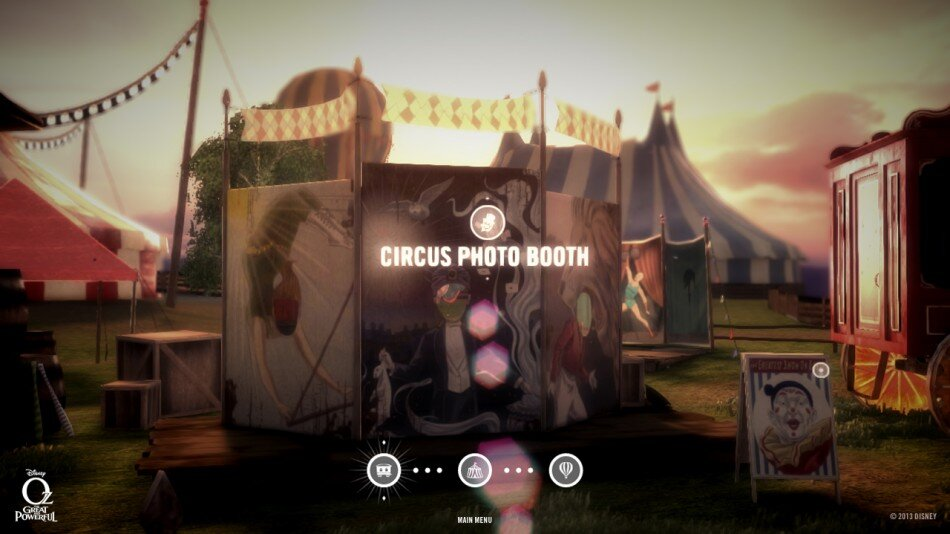
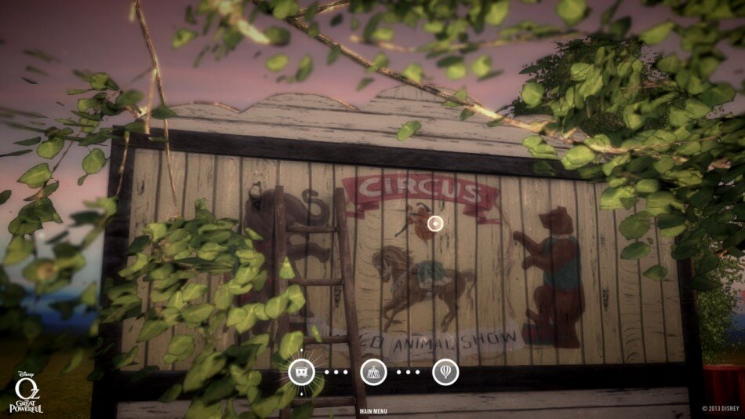
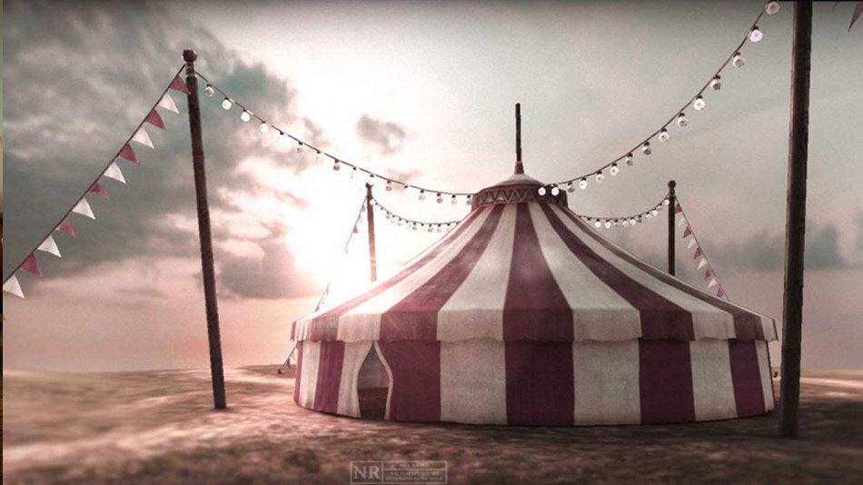
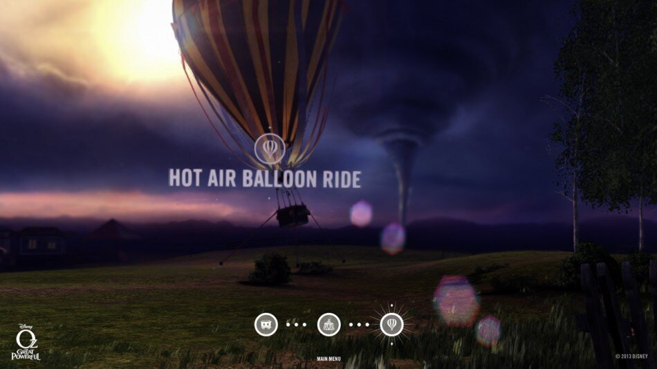
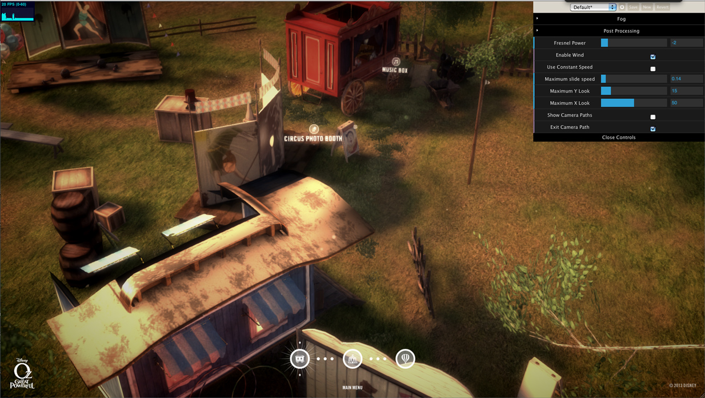
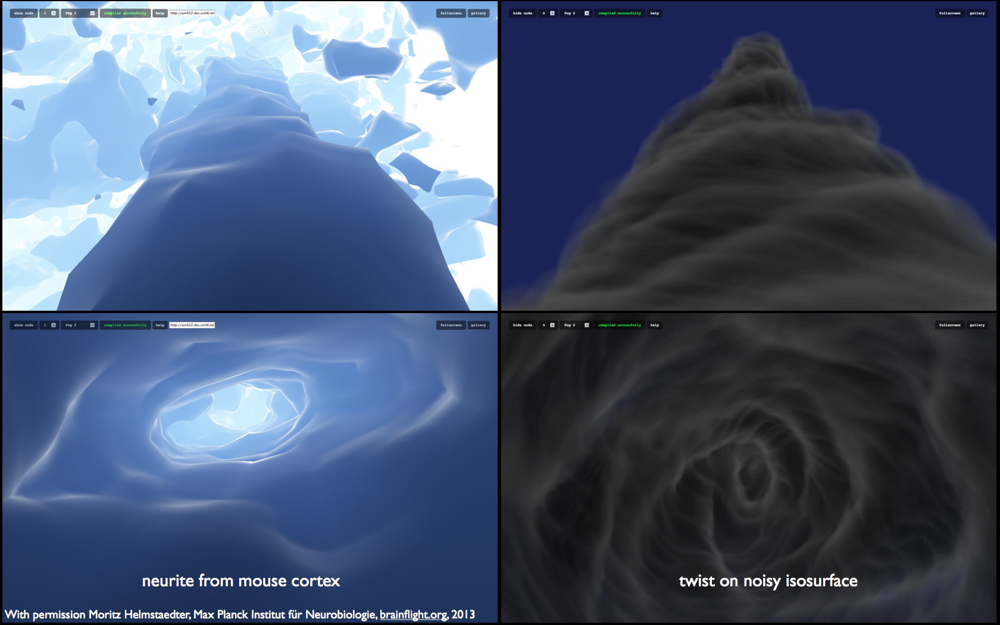
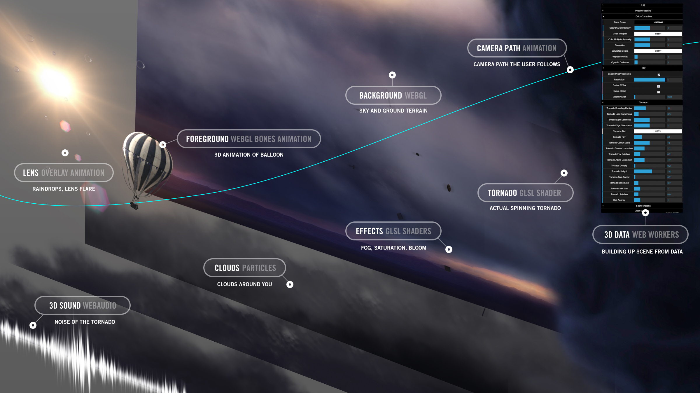

# Find Your Way to Oz

**[Live demo → oz.fluuu.id](https://oz.fluuu.id)**

---

Find Your Way to Oz is a Google Chrome Experiment brought to the web by Disney. It allows you to take an interactive journey through a Kansas circus, which leads you to the land of Oz after you are swept up by a massive storm.

Our goal was to combine the richness of cinema with the technical capabilities of the browser to create a fun, immersive experience that users can form a strong connection with.

The job is a bit too big to capture in its whole in this piece so we've dived in and pulled out some chapters to the technology story that we think are interesting. Many people worked hard to make this experience possible — please visit the site and check out the credits page for the full story.

---

## Gallery

|                            |                           |
| -------------------------- | ------------------------- |
|  |  |
|   |  |
|   |  |

---

## The tornado shader origin story

The vortex at the heart of the storm scene is a volumetric GLSL shader — adapted from a mouse brain cell animation. That's real.



The Disney scene graph and camera path data used to drive the balloon ride:



---

## The tech, in 2013 terms

This was built when browser 3D was still considered a party trick — before WebAssembly, before WebGPU, before Three.js had a stable release.

**Stack:** CoffeeScript · Three.js r55 (custom build) · WebGL 1.0 · Backbone.js 0.9.2 · Web Audio API · getUserMedia · Google AppEngine

- **CoffeeScript** — the entire application (~20k lines) written in CoffeeScript 1.x, compiled to a single `app.js` bundle via a Cakefile. Class hierarchies, event systems, scene management — all of it.
- **Custom GLSL tornado shader** — the vortex is a volumetric shader adapted from a mouse brain cell animation. No physics simulation. The wind, the spinning debris, the funnel — all faked mathematically.
- **Multi-pass rendering pipeline** — the storm scene uses a hand-rolled 6-pass render pipeline: tornado RT → background mesh → tornado composite → front pass → god rays → post FX colour correction. All orchestrated in CoffeeScript.
- **Backbone.js 0.9.2 + RequireJS** — before React, before Vue, before any of that. Scene routing, state management and view lifecycle handled with Backbone views and a custom application shell.
- **Web Audio API (early draft)** — spatial audio with `AudioListener` and positional sound objects tied to the 3D camera.
- **getUserMedia (early draft)** — a live webcam feed composited into a cutout photo booth, years before it was standardised.
- **Five distinct chapters** — Carnival, Zoetrope, Music Box, Cutout, and Storm — each with its own loading strategy, render loop and interaction model.
- **`website/prototypes/`** — the most honest folder in the repo. Every prototype that led to the final result: storm performance tests, wind simulations, WebGL360 video, media source experiments.

---

## 2026 modernisation

The original codebase was frozen in 2013. This fork brings it back to life:

- **Vite dev server** — `npm run dev` replaces the old AppEngine + Cakefile workflow
- **npm scripts** — `npm run coffee:build` recompiles all CoffeeScript sources in the correct dependency order
- **GitHub Actions CI** — build checks on every push
- **Modern browser compatibility** — patches for APIs that changed in 12 years: `MediaStream`, `AudioContext` autoplay policy, pointer lock, compressed textures, `BiquadFilterType` enums, canvas `willReadFrequently`, and more
- **Safari / Firefox unblocked** — the 2013 Chrome-only gate is gone
- **`navigator.share`** — native sharing replaces the dead backend API endpoints
- **StormInteractive** — the interactive balloon ride fully restored with mouse-driven camera orbit and vertical clamping so you're always looking up at the storm

---

## Run it

```bash
npm install
npm run dev
```

Open [http://localhost:5173](http://localhost:5173).

To recompile CoffeeScript after editing source files:

```bash
npm run coffee:build
```

To build for deployment:

```bash
npm run build   # output in /dist
```

---

## Structure

```
project/develop/coffee/   CoffeeScript source (the real code)
project/develop/less/     LESS stylesheets
website/                  Compiled site — what the browser loads
website/prototypes/       Every prototype built during production
docs/                     Reference images and diagrams
```

---

## Awards

- **Awwwards** — Site of the Day + Site of the Month
- **FWA** — Site of the Day + Site of the Month
- **Adobe Cutting Edge Award of the Year** 2013
- **Adobe Cutting Edge Award**

---

## Publications

- [FWA Case Study](https://thefwa.com/cases/find-your-way-to-oz)
- [Awwwards — Site of the Month, February 2013](https://www.awwwards.com/site-of-the-month-february-2013-find-your-way-to-oz-by-unit9.html)
- [Experiments with Google](https://experiments.withgoogle.com/find-your-way-to-oz)
- [TechCrunch](https://techcrunch.com/2013/02/05/google-introduces-find-your-way-to-oz-html5-chrome-experiment-in-collaboration-with-disney-and-unit9/)
- [Chromium Blog](https://blog.chromium.org/2013/02/introducing-find-your-way-to-oz-new.html)
- [Google Blog](https://blog.google/products/chrome/a-chrome-experiment-made-with-some/)
- [The Verge](https://www.theverge.com/2013/2/5/3955246/google-disney-find-your-way-to-oz-chrome-experiment)

---

## Credits

Original experience built by **UNIT9** in collaboration with **Google Labs** and **Disney** (2013).

Lead developer: **Silvio Paganini** — [github.com/silviopaganini](https://github.com/silviopaganini)

---

## License

MIT — see [LICENSE](./LICENSE)
